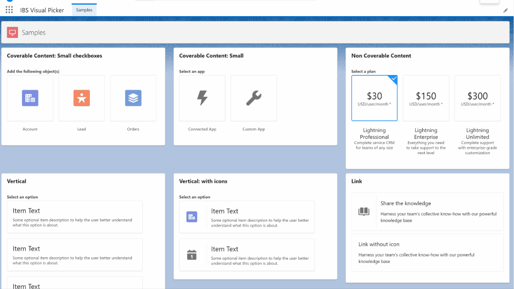

# LWC Visual Picker



## About

SLDS Visual Picker LWC Generic Component Developed because Salesforce doesn't provide a standard component.

## Features
- Native SLDS Style: https://www.lightningdesignsystem.com/components/modals/
- Support all the SLDS variants
- Integrated on a single component (easy to copy to multiple projects)


## Instructions

### Use on your project
Everything was developed in a single LWC, so you just need a new single component on your project.

- Copy the following files to your project:
    - force-app/main/default/lwc/lwcVisualPicker/**
- Call the component and pass the options
```
<c-lwc-visual-picker legend="Add the following object(s)" size="small" multiple-selection options={sampleCoverableContentCheckbox}></c-lwc-visual-picker>

// JS file
sampleNonCoverableContent = [
    {
      label: "Lightning Professional",
      description: "Complete service CRM for teams of any size",
      selected: true,
      cardHeader: "$30",
      cardTitle: "USD/user/month *",
    },
    {
      label: "Lightning Enterprise",
      description: "Everything you need to take support to the next level",
      cardHeader: "$150",
      cardTitle: "USD/user/month *",
    }
]
```

### Testing and learn how to use it

- Run the `createorg.sh` to create a scratch org
- Open the `LWC Visual Picker` lightning app
- Explore the code on the `samples` component
- Edit the page to preview on mobile devices or login with your mobile device (check the `password.env` file)


## References

https://www.lightningdesignsystem.com/components/visual-picker/